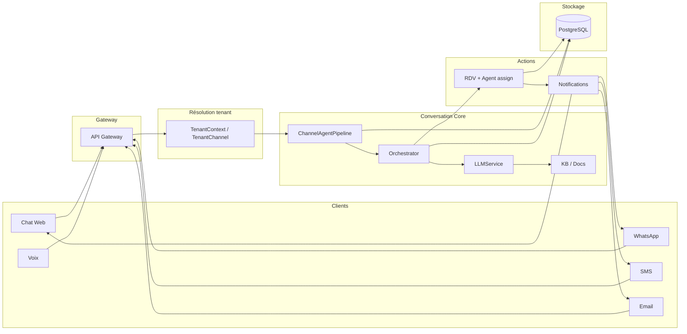
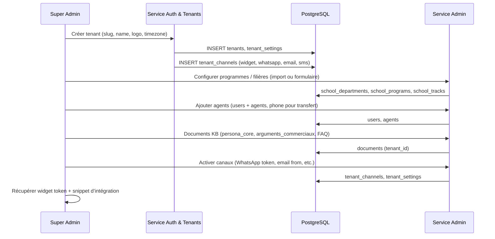
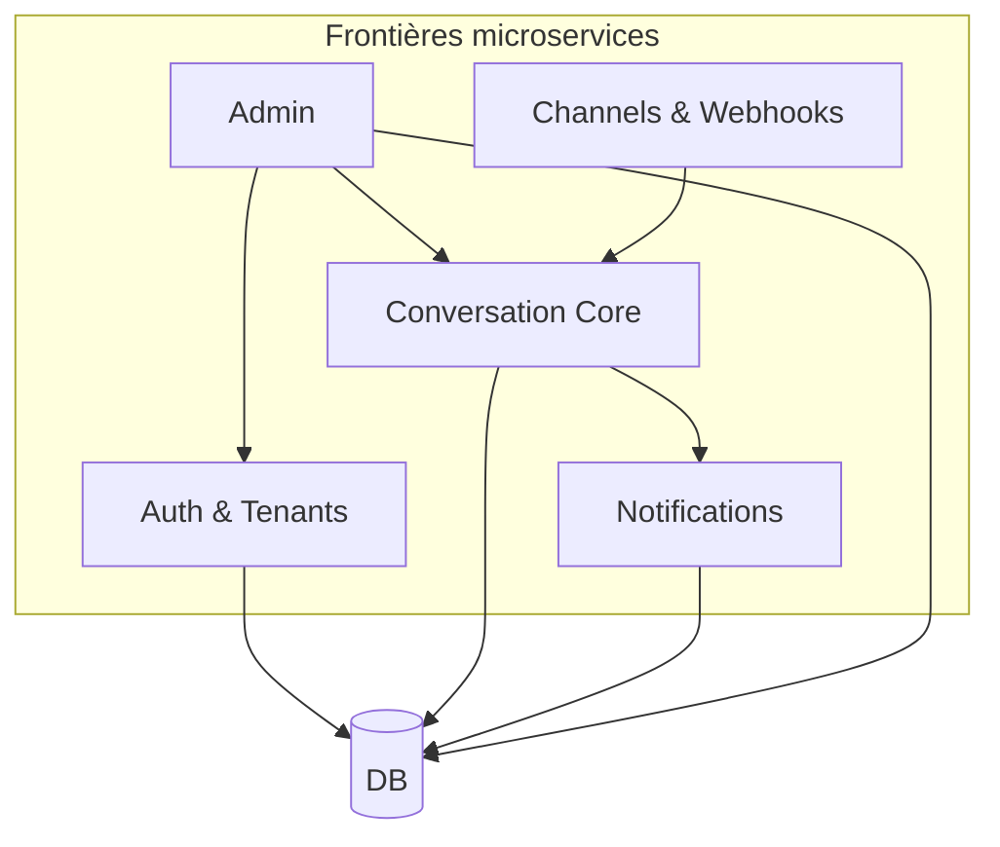
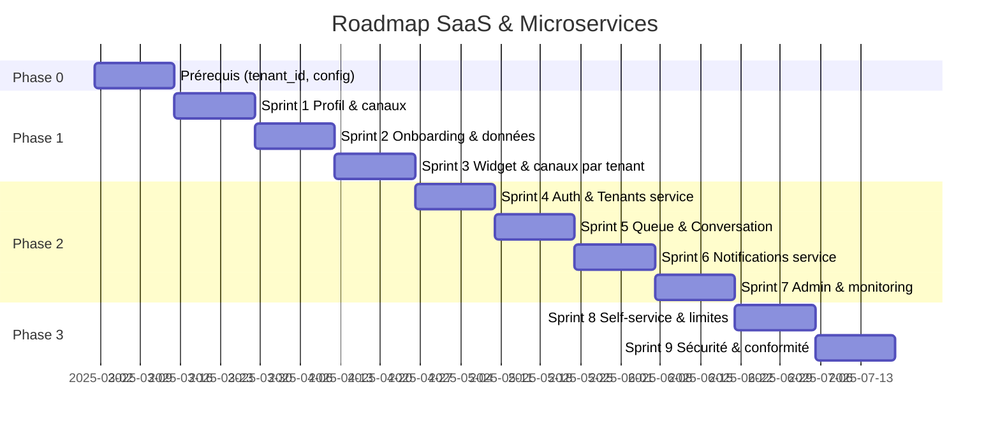

# Plan SaaS & Microservices — AgentIA / Salma

Document de référence : plan détaillé, schémas d’architecture et roadmap par sprint pour faire d’AgentIA une plateforme SaaS multi-écoles, puis une architecture microservices.

---

## 1. Plan détaillé

### 1.1 Objectifs

| Objectif | Description |
|----------|-------------|
| **SaaS multi-écoles** | Chaque école (tenant) dispose de son propre espace : profil, données (programmes, filières, agents), canaux (chat web, WhatsApp, email, SMS, voix) et configuration sans code. |
| **Microservices** | Découper le monolithe actuel en services indépendants (auth/tenants, conversation, canaux, notifications, admin) pour scaler, déployer et maintenir par domaine. |
| **Zéro refonte métier** | Réutiliser au maximum le noyau existant (orchestrateur, LLM, RAG, intent engine, assignation agents, RDV) en le tenant-scoper et en l’exposant via APIs internes. |

### 1.2 Périmètre fonctionnel par école (tenant)

- **Profil école** : nom, slug, logo, couleurs, fuseau horaire, langue par défaut.
- **Données métier** : départements, programmes, filières, frais, conditions d’admission, documents (KB), persona, argumentaire.
- **Agents humains** : utilisateurs “agent” avec disponibilité, max RDV/jour, numéro de téléphone (pour transfert d’appel).
- **Canaux** : activation/désactivation par canal ; configuration par canal :
  - **Chat web** : token widget dédié, URL d’intégration, personnalisation (couleurs, nom de l’assistante).
  - **WhatsApp** : Meta Cloud API (phone_number_id, access_token) ou Twilio (numéro dédié) ; par tenant.
  - **Email** : domaine / expéditeur, provider (Brevo, SendGrid, SMTP) ; par tenant.
  - **SMS** : Twilio ou Orange ; numéro et credentials par tenant.
  - **Voix** : Twilio (numéro, credentials) ; transfert vers agents humains (déjà implémenté côté monolithe).
- **Conversations** : historiques, états, escalades (`pending_review`), résumés ; tout scoppé par `tenant_id`.
- **Observabilité** : KPIs par tenant/canal (déjà en place via `agent_observability` + logs).

### 1.3 Hypothèses techniques

- **Base de données** : une DB partagée avec `tenant_id` sur toutes les tables “école” (déjà le cas) ; pas de DB par tenant en v1.(a revoir car je souhaite une db pour chaque service afin d'avoir une meilleur scalabilite et gestion des données)
- **Auth** : JWT par tenant (issuer/audience) ; résolution du tenant via middleware (`tenant_context`) ou paramètres publics (`provider_key`, `tenant_token`) pour les webhooks.
- **Secrets** : clés API (OpenAI, Twilio, Meta, Brevo, etc.) soit globales en v1, soit stockées par tenant (table `tenant_settings` ou vault) en v2 (je me demande si on peut fournir a chaque tenant sa propre cle API).
- **Queue** : introduite en phase microservices pour découpler réception des messages (webhooks) et traitement (conversation) puis envoi (notifications).

---

## 2. Schémas d’architecture

### 2.1 Architecture actuelle (monolithe multi-tenant)

```
┌─────────────────────────────────────────────────────────────────────────────────┐
│                              CLIENTS / CANAUX                                     │
├──────────┬──────────┬──────────┬──────────┬──────────┬──────────────────────────┤
│ Chat Web │ WhatsApp│   SMS    │  Email   │  Voix    │  Dashboard (admin)       │
│ (widget) │ (Meta/  │ (Twilio/ │ (Brevo/  │ (Twilio  │  (auth JWT)               │
│          │ Twilio) │ Orange)  │ SendGrid)│ Media WS)│                           │
└────┬─────┴────┬────┴────┬─────┴────┬─────┴────┬─────┴────────────┬─────────────┘
     │          │         │          │          │                   │
     ▼          ▼         ▼          ▼          ▼                   ▼
┌─────────────────────────────────────────────────────────────────────────────────┐
│                         API GATEWAY / REVERSE PROXY                              │
│                    (NGINX / Traefik — optional en dev)                           │
└────────────────────────────────────────┬────────────────────────────────────────┘
                                          │
                                          ▼
┌─────────────────────────────────────────────────────────────────────────────────┐
│                        MONOLITHE FASTAPI (AgentIA)                               │
│  ┌──────────────────────────────────────────────────────────────────────────┐  │
│  │ Middleware: tenant_context, rate_limit, CORS, PII-safe logging            │  │
│  └──────────────────────────────────────────────────────────────────────────┘  │
│  ┌─────────────┐ ┌─────────────┐ ┌─────────────┐ ┌─────────────┐             │
│  │ /chat       │ │ /whatsapp   │ │ /sms        │ │ /email      │ /voice/...  │
│  │ /voice      │ │ /webhooks/  │ │ /incoming   │ │ /incoming   │             │
│  │             │ │ meta/wa     │ │             │ │             │             │
│  └──────┬──────┘ └──────┬──────┘ └──────┬──────┘ └──────┬──────┘             │
│         │               │               │               │                     │
│         └───────────────┴───────────────┴───────────────┘                     │
│                                     │                                          │
│                                     ▼                                          │
│  ┌──────────────────────────────────────────────────────────────────────────┐  │
│  │              ChannelAgentPipeline (process_inbound_text)                 │  │
│  │  • Résolution conversation (session_id, person_id, thread_key, call_sid) │  │
│  │  • LLM extract (structured_message) → ConversationOrchestrator           │  │
│  │  • Booking finalization (RDV + assignation agent + notifications)         │  │
│  │  • Persist turn + observability log                                      │  │
│  └──────────────────────────────────────────────────────────────────────────┘  │
│         │                        │                        │                     │
│         ▼                        ▼                        ▼                     │
│  ┌─────────────┐  ┌─────────────────────────┐  ┌─────────────────────────┐   │
│  │ Conversation│  │ LLMService              │  │ llm_tools                │   │
│  │ Orchestrator│  │ (persona, KB, tools)    │  │ (get_track_tuition,     │   │
│  │ (flows,     │  │ + call_handoff (voice)  │  │  create_school_        │   │
│  │  slots)     │  │                         │  │  appointment, etc.)      │   │
│  └─────────────┘  └─────────────────────────┘  └─────────────────────────┘   │
│         │                        │                        │                     │
│         └────────────────────────┴────────────────────────┘                     │
│                                     │                                          │
│  ┌─────────────────────────────────┼──────────────────────────────────────┐  │
│  │ kb (conversations, messages)    │ docs, rag, agent_assignment,          │  │
│  │ tenant_context, TenantChannel   │ notification_dispatch, email, sms,   │  │
│  │                                 │ whatsapp, intent_engine               │  │
│  └─────────────────────────────────┴──────────────────────────────────────┘  │
└─────────────────────────────────────┬─────────────────────────────────────────┘
                                      │
                                      ▼
┌─────────────────────────────────────────────────────────────────────────────────┐
│                    BASE DE DONNÉES (PostgreSQL)                                 │
│  tenants | tenant_channels | tenant_settings | users | agents | conversations  │
│  messages | documents | school_* | rendezvous | persons | ...                   │
└─────────────────────────────────────────────────────────────────────────────────┘
```

### 2.2 Architecture cible (microservices)

```
┌─────────────────────────────────────────────────────────────────────────────────┐
│                              CLIENTS / CANAUX                                     │
│  Chat Web │ WhatsApp │ SMS │ Email │ Voix │ Dashboard Admin (par école)          │
└────┬──────┴────┬─────┴──┬──┴───┬───┴──┬───┴────────────────┬────────────────────┘
     │           │        │      │      │                     │
     ▼           ▼        ▼      ▼      ▼                     ▼
┌─────────────────────────────────────────────────────────────────────────────────┐
│                         API GATEWAY (Kong / NGINX / Traefik)                    │
│         Routing par path & tenant_slug / token • TLS • rate limit global         │
└─────────────────────────────────────────────────────────────────────────────────┘
     │           │        │      │      │                     │
     ▼           ▼        ▼      ▼      ▼                     ▼
┌─────────────┐  ┌─────────────────────────────────────────────────────────────┐
│ Service     │  │ Service CHANNELS & WEBHOOKS                                 │
│ Auth &      │  │ • /webhooks/twilio/sms, /whatsapp/incoming, /meta/wa         │
│ Tenants     │  │ • /email/incoming                                            │
│             │  │ • Résout tenant (provider_key, tenant_token) → enqueue       │
│ • /auth/*   │  │   message + tenant_id                                        │
│ • /tenants  │  └─────────────────────────────┬───────────────────────────────┘
│ • /users    │                                 │
│ • /agents   │                                 ▼
│ • JWT       │  ┌─────────────────────────────┴───────────────────────────────┐
└──────┬──────┘  │ Message Queue (Kafka / RabbitMQ / SQS)                        │
       │         │ Topics: inbound.chat | inbound.whatsapp | inbound.email | …  │
       │         └─────────────────────────────┬───────────────────────────────┘
       │                                      │
       │                                      ▼
       │         ┌─────────────────────────────────────────────────────────────┐
       │         │ Service CONVERSATION CORE                                   │
       │         │ • Consume queue → ChannelAgentPipeline (unchanged logic)    │
       │         │ • ConversationOrchestrator, LLMService, RAG, intent_engine  │
       │         │ • DB: conversations, messages, conversation_state          │
       │         │ • Publish: outbound.reply (pour notifications)               │
       │         └─────────────────────────────┬───────────────────────────────┘
       │                                      │
       │                                      ▼
       │         ┌─────────────────────────────┴───────────────────────────────┐
       │         │ Queue: outbound.reply (channel, to, body, tenant_id)          │
       │         └─────────────────────────────┬───────────────────────────────┘
       │                                      │
       │                                      ▼
       │         ┌─────────────────────────────────────────────────────────────┐
       │         │ Service NOTIFICATIONS & OUTBOX                               │
       │         │ • Email (Brevo/SendGrid), SMS (Twilio/Orange), WhatsApp       │
       │         │ • Config par tenant (TenantChannel, tenant_settings)          │
       │         └─────────────────────────────────────────────────────────────┘
       │
       │         ┌─────────────────────────────────────────────────────────────┐
       │         │ Service ADMIN / BACK-OFFICE                                  │
       │         │ • CRUD tenants, school_*, documents, agents, persona         │
       │         │ • Config canaux (widget token, WhatsApp, email, SMS)           │
       │         │ • Liste conversations, pending_review, KPIs                   │
       │         └─────────────────────────────────────────────────────────────┘
       │
       ▼
┌─────────────────────────────────────────────────────────────────────────────────┐
│                    BASE DE DONNÉES (PostgreSQL) — partagée ou par service       │
│  tenants | tenant_channels | tenant_settings | users | agents | school_*       │
│  conversations | messages | documents | rendezvous | persons | ...              │
└─────────────────────────────────────────────────────────────────────────────────┘
```

### 2.3 Diagramme logique — Flux de données (SaaS, un tenant)



### 2.4 Diagramme — Onboarding d’une école (tenant)



### 2.5 Dépendances entre services (cible)



---

## 3. Roadmap par sprint

### Légende

- **SaaS** : fonctionnalité orientée multi-tenant / self-service école.
- **MS** : étape vers la découpe microservices.
- **Infra** : infrastructure (CI/CD, queue, monitoring).

---

### Phase 0 — Prérequis (1 sprint)

| Id | Tâche | Type | Livrable |
|----|--------|------|----------|
| 0.1 | Vérifier que toutes les tables métier ont `tenant_id` et que les requêtes sont scopées | SaaS | Liste des écarts + migrations si besoin |
| 0.2 | Centraliser la config “école” : `TenantSettings` (déjà en place), étendre si besoin (logo_url, primary_color, widget_title) | SaaS | Schéma + migrations |
| 0.3 | Documenter la résolution tenant (middleware, `provider_key`, `tenant_token`, JWT) | SaaS | Doc technique interne |

---

### Phase 1 — SaaS dans le monolithe (3 sprints)

#### Sprint 1 — Profil et config par école

| Id | Tâche | Type | Livrable |
|----|--------|------|----------|
| 1.1 | Modèle/API : profil tenant (nom, slug, logo_url, primary_color, timezone, default_language) | SaaS | Modèle + PATCH /tenants/{id} |
| 1.2 | API : config des canaux par tenant (widget_token, whatsapp_provider + credentials, email_from, sms_sender) stockée en `tenant_channels` / `tenant_settings` | SaaS | Endpoints CRUD ou settings |
| 1.3 | Génération sécurisée d’un `widget_token` par tenant (stocké hashé, exposé une fois à l’admin) | SaaS | Endpoint + doc intégration widget |
| 1.4 | Dashboard (ou API) : écran “Configuration école” (profil + canaux) | SaaS | UI ou API consommable par une future UI |

#### Sprint 2 — Onboarding et isolation des données

| Id | Tâche | Type | Livrable |
|----|--------|------|----------|
| 2.1 | Workflow “Création d’une école” : créer tenant + admin école + tenant_settings + tenant_channels par défaut | SaaS | Script ou endpoint d’onboarding |
| 2.2 | S’assurer que school_*, documents, agents, conversations, messages sont strictement filtrés par `tenant_id` (audit des requêtes) | SaaS | Audit + correctifs |
| 2.3 | Documents KB : CRUD par tenant (tags: persona_core, arguments_commerciaux, faq, calendrier) | SaaS | API /knowledge_base ou /documents scopée tenant |
| 2.4 | Persona et argumentaire : lecture par tenant dans LLM (déjà via docs par tag) ; vérifier scope tenant dans `get_document_by_tag` | SaaS | Vérif + tests |

#### Sprint 3 — Widget et canaux par école

| Id | Tâche | Type | Livrable |
|----|--------|------|----------|
| 3.1 | Chat web : résolution tenant via `X-Widget-Token` ou `tenant_slug` + validation token par tenant (table tenant_channels) | SaaS | Middleware ou délégué auth widget |
| 3.2 | Widget embarqué : paramètres `data-tenant`, `data-widget-token` ; appel API avec tenant résolu | SaaS | Snippet d’intégration + doc |
| 3.3 | WhatsApp / SMS / Email : utilisation des credentials du tenant (TenantChannel / tenant_settings) au lieu des variables d’environnement globales | SaaS | Refactor des services email, sms, whatsapp |
| 3.4 | Tests E2E : deux tenants, deux configurations de canaux, pas de fuite de données | SaaS | Scénarios de tests |

---

### Phase 2 — Découpage microservices (4 sprints)

#### Sprint 4 — Auth & Tenants en service dédié

| Id | Tâche | Type | Livrable |
|----|--------|------|----------|
| 4.1 | Extraire routes `/auth`, `/tenants`, `/users`, `/agents` dans un service “Auth & Tenants” (même DB ou schéma partagé) | MS | Nouveau repo ou module déployable |
| 4.2 | Exposer API interne “resolve_tenant_by_token” / “validate_jwt” pour les autres services | MS | Client HTTP ou lib partagée |
| 4.3 | API Gateway : router `/auth/*`, `/tenants/*` vers le service Auth & Tenants | Infra | Config gateway |

#### Sprint 5 — Queue et service Conversation

| Id | Tâche | Type | Livrable |
|----|--------|------|----------|
| 5.1 | Introduire une queue (Kafka/RabbitMQ/SQS) : topic `inbound.messages` (payload: channel, tenant_id, user_message, conversation_id, …) | Infra | Queue + schéma de message |
| 5.2 | Service “Channels & Webhooks” : webhooks Twilio/Meta/Email écrivent dans la queue au lieu d’appeler directement le pipeline | MS | Nouveau service + adaptateurs webhook |
| 5.3 | Service “Conversation Core” : consumer de la queue, appelle `ChannelAgentPipeline` (code existant), publie les réponses sur topic `outbound.replies` | MS | Service Conversation + config consumer |
| 5.4 | Garder en parallèle l’appel direct au monolithe pour le chat web (même code) jusqu’à migration complète | MS | Option de routage |

#### Sprint 6 — Service Notifications

| Id | Tâche | Type | Livrable |
|----|--------|------|----------|
| 6.1 | Service “Notifications & Outbox” : consumer de `outbound.replies`, envoi email/SMS/WhatsApp selon canal et config tenant | MS | Service Notifications |
| 6.2 | Config par tenant : lecture des credentials (Twilio, Meta, Brevo) depuis DB (tenant_channels / tenant_settings) | SaaS | Refactor déjà amorcé en Phase 1 |
| 6.3 | Retries, dead-letter, métriques d’envoi (déjà partiellement en place via outbox) | Infra | Observabilité |

#### Sprint 7 — Admin et monitoring

| Id | Tâche | Type | Livrable |
|----|--------|------|----------|
| 7.1 | Service “Admin / Back-office” : CRUD tenants, school_*, documents, agents ; config canaux ; liste conversations, pending_review | MS | Service Admin ou extension dashboard |
| 7.2 | API Gateway : routes /admin/*, /kb/*, /school/* vers service Admin ou monolithe selon découpe | Infra | Config gateway |
| 7.3 | Monitoring unifié : logs structurés (agent_turn_processed), métriques (Prometheus), alertes (Sentry) par service et par tenant | Infra | Dashboards + runbooks |

---

### Phase 3 — Consolidation SaaS (2 sprints)

#### Sprint 8 — Self-service et facturation (optionnel)

| Id | Tâche | Type | Livrable |
|----|--------|------|----------|
| 8.1 | Portail d’onboarding : formulaire “Créer mon école”, création tenant + admin, wizard config (profil, premier canal) | SaaS | UI + APIs |
| 8.2 | Limites par tenant : monthly_message_limit, monthly_rdv_limit (déjà en tenant_settings) ; refus dépassement avec message clair | SaaS | Middleware ou check dans pipeline |
| 8.3 | Facturation : hooks “usage” (messages, RDV) pour intégration future à un billing (Stripe, etc.) | SaaS | Événements ou table usage_events |

#### Sprint 9 — Sécurité et conformité

| Id | Tâche | Type | Livrable |
|----|--------|------|----------|
| 9.1 | Audit des accès : tout accès aux données tenant via JWT ou token validé ; logs d’accès admin | SaaS | Audit + doc |
| 9.2 | RGPD : export/suppression des données personnelles par tenant (déjà partiellement en place via /gdpr) | SaaS | Vérif + compléments |
| 9.3 | Secrets par tenant : stockage des clés API (WhatsApp, Twilio, etc.) chiffré par tenant (vault ou colonnes chiffrées) | SaaS | Design + implémentation minimale |

---

## 4. Résumé des livrables par phase

| Phase | Sprints | Objectif principal |
|-------|--------|--------------------|
| **0** | 1 | Schéma et config tenant prêts |
| **1** | 3 | Chaque école a son profil, ses canaux, son widget et ses données isolées (toujours en monolithe) |
| **2** | 4 | Services séparés : Auth/Tenants, Channels (queue), Conversation, Notifications, Admin |
| **3** | 2 | Onboarding self-service, limites, préparation facturation et sécurité |

---

## 5. Fichiers et composants existants à réutiliser

- **Multi-tenant** : `app/models.Tenant`, `TenantChannel`, `TenantSettings` ; `app/services/tenant_context.py` ; middleware dans `app/main.py`.
- **Conversation** : `app/services/channel_agent_pipeline.py`, `conversation_orchestrator.py`, `llm.py`, `llm_tools.py`, `intent_engine.py`, `call_handoff.py`.
- **KB / RAG** : `app/services/docs.py`, `rag.py` ; table `documents` (avec `tenant_id` si déjà présent).
- **Observabilité** : `app/services/agent_observability.py` ; logs `agent_turn_processed` ; `app/routers/monitoring.py`.
- **Config** : `app/config.py` (variables globales) ; à terme étendre par `tenant_settings` pour les secrets et options par école.

---

## 6. Diagramme Gantt simplifié (ordre des sprints)



---

*Document généré pour le projet AgentIA — Salma School Assistant. À mettre à jour au fil des sprints.*
